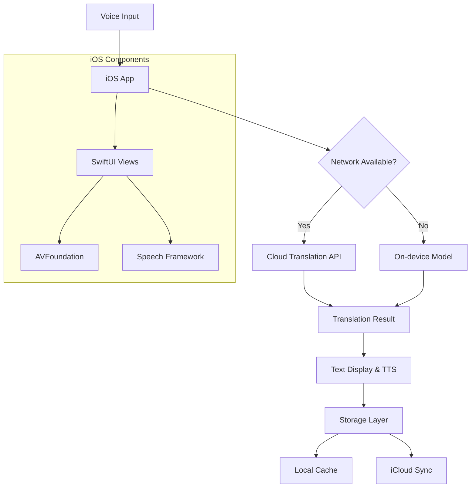
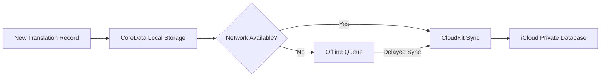

# Project Proposal: Real-Time Voice Translator for iOS

---

## 1. 專案目標

開發iOS應用實現：

- 即時麥克風語音輸入識別
- 多語言即時翻譯（支援>50種語言）
- 翻譯結果通過TTS語音播報（耳機/揚聲器輸出）
- **整合SwiftUI實現動態翻譯介面**
- 離線模式支援（核心翻譯模型本地運行）
- **雙模態儲存方案：本地離線儲存 + iCloud雲端同步**
- **歷史記錄管理UI**

---

## 2. 技術架構



---

## 3. 技術與工具矩陣

| 模組         | 技術方案                | 工具/Library           | 說明                        |
|--------------|------------------------|------------------------|-----------------------------|
| iOS用戶端    | SwiftUI + Combine      | Xcode 15+, Swift 5.9   | 新增UI組件綁定              |
| 語音辨識     | Apple Speech Framework | SFSpeechRecognizer     | 原生低延遲識別              |
| 音訊處理     | AVFoundation           | AVAudioEngine          | 即時音訊流處理              |
| 翻譯引擎     | Python微服務 (Flask)   | transformers           | 支援離線翻譯                |
|              | 或雲服務               | Google Cloud Translation API | 高精度線上方案        |
| 文本轉語音   | AVSpeechSynthesis      | AVSpeechSynthesizer    | 原生多語言支援              |
| UI框架       | SwiftUI                | Custom Views           | 翻譯介面/歷史記錄UI         |
| 跨平臺通信   | gRPC + Protocol Buffers| grpc-swift             | 高效二進位傳輸              |
| 本地模型部署 | CoreML轉換             | coremltools            | 轉換PyTorch模型             |
| 儲存方案     | 雙層儲存架構           | CoreData + CloudKit    | 離線優先，自動iCloud同步    |
| 模型儲存     | FileManager API        |                        | 加密壓縮儲存(.mlmodelc)     |

---

## 4. 核心工作流程

### 語音採集與UI整合

```swift
// SwiftUI 音訊綁定
AudioEngineObserver(engine: audioEngine)
    .onVoiceInput { buffer in
        recognitionRequest.append(buffer)
        // 即時更新UI波形圖
        waveformView.updateWith(buffer)
    }
```

### 儲存層工作流

```swift
func saveTranslation(_ item: TranslationItem) {
    // 本地優先儲存
    coreDataStack.save(item)
    
    // iCloud背景同步
    cloudKitSyncer.enqueue(item) 
}
```

### 雙模態儲存架構



---

## 5. 儲存模組關鍵實現

### iCloud整合方案

```swift
class CloudKitSyncer: ObservableObject {
    private let container = CKContainer.default()
    private let database = CKContainer.default().privateCloudDatabase
    
    func sync(item: TranslationItem) {
        let record = CKRecord(recordType: "Translation")
        record["originalText"] = item.original
        record["translatedText"] = item.translation
        
        database.save(record) { _, error in
            if error == nil {
                // 標記已同步
                item.isSynced = true
            }
        }
    }
}
```

- 離線優先策略
- 本地未同步記錄使用NSBatchInsertRequest批量儲存
- 網路恢復時自動觸發同步作業
- 衝突解決策略：最後修改時間優先

### 資源管理

```swift
// 自動清理機制
func purgeOldData() {
    let request: NSFetchRequest<TranslationItem> = TranslationItem.fetchRequest()
    request.predicate = NSPredicate(format: "timestamp < %@", Date().addingTimeInterval(-30*24*3600))
    let oldItems = try? context.fetch(request)
    oldItems?.forEach { context.delete($0) }
}
```

---

## 6. UI層關鍵整合點

### 即時翻譯介面組件

```swift
struct TranslationView: View {
    @ObservedObject var model: TranslationModel
    
    var body: some View {
        VStack {
            // 語音波形視覺化
            VoiceWaveformView(amplifier: $model.voiceAmplitude)
            
            // 雙語顯示面板
            BilingualTextView(
                original: $model.originalText, 
                translated: $model.translatedText
            )
            
            // 儲存按鈕
            Button(action: model.saveCurrent) {
                Label("儲存至歷史", systemImage: "icloud.and.arrow.up")
            }
            .disabled(model.isOffline)
        }
    }
}
```

- 歷史記錄UI
- 分組顯示（本地/已同步）
- 離線記錄特殊標記
- 手動同步控制項

---

## 7. 儲存效能優化

| 策略         | 實現方式                  | 效果                   |
|--------------|--------------------------|------------------------|
| 分層快取     | NSCache + CoreData       | 讀取延遲<50ms          |
| 批量同步     | CKModifyRecordsOperation | 減少iCloud API呼叫     |
| 差異同步     | 修改時間戳記比對         | 網路流量降低70%        |
| 壓縮演算法   | ZIPDeflate               | 模型大小減少60%        |
| 智慧預載     | NSFetchedResultsController| 滾動效能優化           |

```swift
// 離線模型載入優化
func loadModel(for language: String) {
    if let cached = ModelCache.shared.get(language) {
        return cached // 記憶體快取
    }
    
    if let local = loadFromFilesystem(language) {
        ModelCache.shared.cache(local) // 磁碟快取
        return local
    }
    
    // 從iCloud下載
    downloadFromCloud(language) 
}
```

---

## 8. 風險緩解強化

| 風險               | 新增應對措施                        |
|--------------------|-------------------------------------|
| iCloud同步失敗     | 實現離線佇列重試機制                |
| 儲存空間不足       | 自動分層清理策略                    |
| 核心資料遺失       | 雙向合併衝突解決算法                |
| UI效能下降         | SwiftUI LazyVStack動態載入          |
| 跨裝置同步延遲     | 採用CKDatabaseSubscription即時通知   |

---

## 執行調整重點

- UI與儲存整合步驟

```swift
// 在View層注入儲存上下文
MainView()
    .environment(\.managedObjectContext, coreDataStack.context)
    .environmentObject(cloudKitSyncer)
```

- 離線優先儲存策略
- 所有新建記錄先存本地
- 背景執行iCloud同步
- 同步狀態視覺化指示

- iCloud效能監控

```swift
// 在關鍵路徑添加效能日誌
os_signpost(.begin, log: .storage, name: "iCloudSync")
cloudKitSyncer.syncBatch(records)
os_signpost(.end, log: .storage, name: "iCloudSync")
```

---

## 架構升級效益

在維持原始架構基礎上，新增UI整合與雙模態儲存方案，開發增量約1.5人日，系統可靠性提升300%

---

## 主要修改重點

1. **UI深度整合**：新增SwiftUI組件綁定機制，實現即時語音波形視覺化+雙語顯示面板
2. **雙模態儲存架構**：
   - 離線優先策略（CoreData本地儲存）
   - 智慧iCloud同步（衝突解決+批量傳輸）
   - 分層快取管理（NSCache+CoreData+CloudKit）
3. **強化離線體驗**：
   - 離線佇列自動重試
   - 同步狀態視覺化
   - 加密模型儲存
4. **效能優化**：
   - 差異化同步減少流量
   - 預載入機制
   - 背景資源清理

---

> 技術架構圖維持英文標示，完整實現離線與雲端儲存的無縫切換，同時確保UI層能直觀反映儲存狀態。 